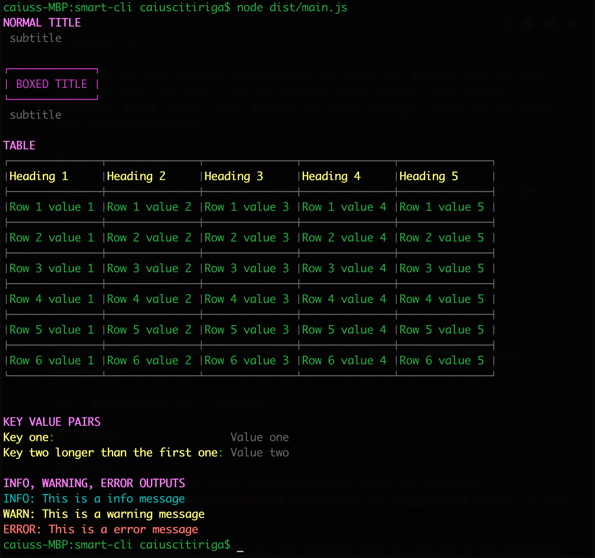

# SmartCLI
A library for node terminal applications that helps you dealing with the user's input and helps you with a tool of standard ouput formats. Like titles, subtitles, boxed titles. Info, warning and error messages, table and key-value pairs data presentation.

## Getting Started
These instructions will get you a copy of the project up and running on your local machine.

### Installing
Install the library
```
npm i smart-cli
```

# Examples
You can find a picture listing all the examples here at the end of the examples.

## Title
This will print out the given string in magenta (Chalk color) all uppercase
We will access the **GenericOutput** property of the **SmartCLI** object, to use these output types.


```typescript
import * as SCLI from 'smart-cli';

SCLI.GenericOutput.printTitle('Normal title');
```

## SubTitle
This will print out the given string in grey (Chalk color) without any transformation.
We will access the **GenericOutput** property of the **SmartCLI** object, to use these output types.


```typescript
import * as SCLI from 'smart-cli';

SCLI.GenericOutput.printSubTitle('subtitle'); // will output: subtitle
SCLI.GenericOutput.printSubTitle('Subtitle'); // will output: Subtitle
```

## BoxedTitle
This will print out the given string in magenta (Chalk color) all uppercase, surrounded by a 'box'.
We will access the **GenericOutput** property of the **SmartCLI** object, to use these output types.


```typescript
import * as SCLI from 'smart-cli';

SCLI.GenericOutput.printBoxedTitle('Boxed title');
```

## KeyValue pairs
This will print out the given array of key-value objects:
```typescript
{key: string; value: string}
```
Even this time you won't have to worry about any alignment. **SmartCLI** will be smart enough (hahah) to take the longest key and use its length as the standard spacing for all the other ones.

We will access the **GenericOutput** property of the **SmartCLI** object, to use these output types.


```typescript
import * as SCLI from 'smart-cli';

SCLI.GenericOutput.printKeyValue([
    { key: 'Key one', value: 'Value one' },
    { key: 'Key two longer than the first one', value: 'Value two' }
]);
```

## Table
This will output a table. It will take a **TableStructure** object which is composed like this:
```typescript
export class TableStructure {
    heading: string[];
    rows: Array<string[]>
}
```
* **heading** will be an array containing all the columns names. Each string will be a column.
* **rows** will be an array containing arrays of strings. Each array of strings will be a new row of the table. **Be sure that all the rows has the same number of elements as the heading property.**

The table will be smart enough to find the longest value/heading word, and use that to give the size to each cell. In this way you won't have to worry about giving sizes to each cell.


```typescript
import * as SCLI from 'smart-cli';

//  Create the table configuration object
const tbl = new TableStructure();

//  Declare the headings
tbl.heading = ['Heading 1', 'Heading 2', 'Heading 3'];

//  Declare the rows
tbl.rows = [
    ['Row 1 value 1', 'Row 1 value 2', 'Row 1 value 3'],
    ['Row 2 value 1', 'Row 2 value 2', 'Row 2 value 3'],
    ['Row 3 value 1', 'Row 3 value 2', 'Row 3 value 3'],
    ['Row 4 value 1', 'Row 4 value 2', 'Row 4 value 3'],
    ['Row 5 value 1', 'Row 5 value 2', 'Row 5 value 3'],
    ['Row 6 value 1', 'Row 6 value 2', 'Row 6 value 3'],
];

//  Render the table
SCLI.printTable(tbl);
```

## INFO messages
This will take a string and it prints it out in cyan (Chalk color), prepending the word INFO:

We will access the **GenericOutput** property of the **SmartCLI** object, to use these output types.


```typescript
import * as SCLI from 'smart-cli';
SCLI.GenericOutput.printInfo('This is a info message');
```

## WARNING messages
This will take a string and it prints it out in yellow (Chalk color), prepending the word WARN:

We will access the **GenericOutput** property of the **SmartCLI** object, to use these output types.


```typescript
import * as SCLI from 'smart-cli';
SCLI.GenericOutput.printWarning('This is a warning message');
```

## ERROR messages
This will take a string and it prints it out in red (Chalk color), prepending the word ERROR:

We will access the **GenericOutput** property of the **SmartCLI** object, to use these output types.


```typescript
import * as SCLI from 'smart-cli';
SCLI.GenericOutput.printError('This is a error message');
```

## Prompt
This will take a string as message to be shown to the user, and a **callback** function that takes one **string** parameter ***answer*** that must return a **boolean**.

```typescript
import * as SCLI from 'smart-cli';

//  Define the callback function
const promptHandler = (answer: string) => {
    switch (answer.toLowerCase()) {
        case 'y':
            SC.printTable(tbl); //  Pretend it's defined somewhere
            return true;
        case 'f':
            console.log('Ugly you then!');
            return true;
        default:
            SC.prompt('Not a valid answer. Use y or n: ', promptHandler);
            return false;
    }
};

//  Run the prompt
SC.prompt('Hey! Wanna see a cool table? Type y or n: ', promptHandler);
```

### Here's a picture of how each output would look like. 
Please keep in mind that your colors might change based on your terminal's color palette



## Built With
* [Chalk](https://github.com/chalk/chalk) - Terminal string styling done right

## Versioning
We use [SemVer](http://semver.org/) for versioning. For the versions available, see the [tags on this repository](https://github.com/caiuscitiriga/smart-cli/tags). 

## Authors
* [**Caius Citiriga**](https://github.com/caiuscitiriga)


## License
This project is licensed under the MIT License - see the [LICENSE.md](LICENSE.md) file for details

## Acknowledgments
* [Automattic](https://github.com/Automattic) for the table fonts.
